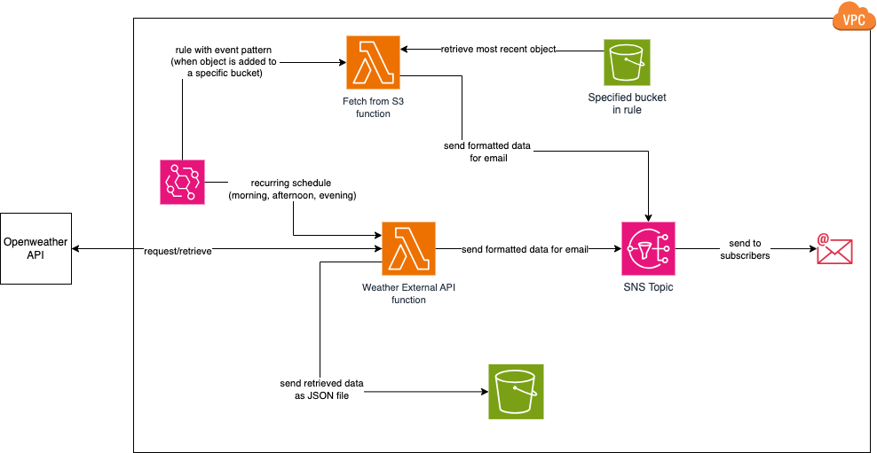

# Notification Alerts System

## About
This project explores using AWS Lambda Functions which send emails alerts via Amazon SNS.

These functions are invoked using Amazon EventBridge (and Amazon S3 Event Notifications):
- a recurring schedule to send weather alerts for Manchester everyday (morning, afternoon and evening),
- when a new file is added to an S3 bucket (linking back to [this project](https://github.com/khairahscorner/weather-dashboard))

## Stack 
- AWS Lambda (Python functions)
- AWS IAM (creating roles and attaching policies for permissions)
- Amazon SNS (sending notifications)
- Amazon EventBridge (triggers)
- Amazon S3
- Bash scripts

## Architectural Diagram

## Learnings
- Designing a notification system with SNS and Lambda.
- Securing AWS services with least privilege IAM policies.
- Storing/Retrieving files and event notification triggers with S3.
- Automating workflows with schedules and service triggers using EventBridge.
- Bash scripting

## Documentation
- [Blog Post](https://khairahscorner.hashnode.dev/leveraging-lambda-functions-with-amazon-sns-s3-eventbridge)
- [docs.md](docs.md)